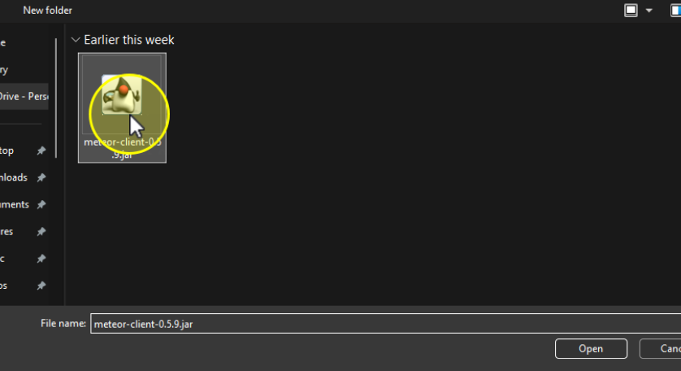

## Install via Modrinth Launcher?

1. Open up Modrinth Launcher and click on your desired Minecraft instance.

{width=50%}

2. Click on **drop-down Arrow**, next to Install Content button.

{width=50%}

3. Click on **Add from file**.

{width=50%}

4. Select your desired Minecraft mod and Click **Open**.

## Manually Install Mods

1. Copy your desired `Mod.jar` file.
2. Press  <Tag icon="pi pi-microsoft" value="Windows"></Tag> + <Tag value="R"></Tag>
3. In the Run, enter `%appdata%/ModrinthApp/profiles` and Press **OK**.
4. Go to your Minecraft Instance folder (profile).
5. Open <Tag severity="secondary" icon="pi pi-folder" value="mods"></Tag> Folder
6. Paste your desired `Mod.jar` file in the folder.
